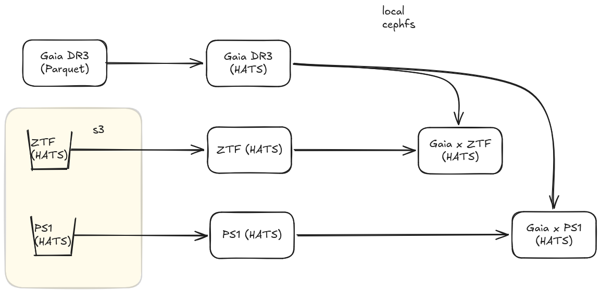

# Gaia Data Integration Pipeline

This is a Dagster-based pipeline for building, validating, and crossmatching large astronomical HATS catalogs, including ZTF, PS1, Gaia, and derived crossmatched products, using LSDB.

The system includes HATS catalog ingestion and validation, crossmatching via LSDB, dataset integrity checks at the partition level, crossmatch quality checks, and lightweight observability through Dagster asset checks.


## Current crossmatching
This pipeline currently crossmatches ZTF and PS1. 




## Architecture overview

Dagster orchestrates the pipeline, which consists of:

* Assets for ingestion and crossmatch computation
* Asset checks for data validation
* Dask for distributed execution
* LSDB for catalog access and crossmatching


## Pipeline assets

### Base ingestion assets:

* ztf_hats
  Downloads ZTF HATS partitions from S3 and prepares the dataset

* ps1_hats
  Loads PS1 object and detection catalogs

* gaia_hats
  Builds the Gaia HATS catalog from parquet inputs


### Crossmatched assets:

* gaia_ztf_xmatched
  Gaia × ZTF spatial crossmatch using LSDB and Dask

* gaia_ps1_xmatched
  Gaia × PS1 spatial crossmatch using LSDB and Dask

Crossmatching is performed using a Dask client and the gaia_xmatch_hats.crossmatch_with_gaia function.


## Data quality checks

All datasets are validated using Dagster asset checks built on shared helper functions in `check_helpers.py`.

Base HATS checks (ZTF / PS1 / Gaia):

* Required metadata files exist (hats.properties, partition_info.csv, schema.txt, linecounts.txt, md5sums.txt)
* Partition information is valid and consistent
* Sampled partitions exist on disk
* Sampled partition row counts match Parquet metadata

Crossmatch checks:

* LSDB catalog can be opened successfully
* Required schema fields exist (ra, dec)
* Crossmatch output is non-empty


### Core validation helpers

All validation logic is centralized in `check_helpers.py`. Key functions include:

* get_root(context, dataset)
* load_partition_info(root)
* sample_partitions(df)
* partition_path(root, row)
* check_metadata_files(root)
* check_partition_info(df)
* check_partitions_exist(root, sample_df)
* check_rowcounts(root, sample_df)

These implement the shared HATS validation kernel used across all datasets.


## Running the pipeline

Run with Dagster:
```
uv run dg launch --config config.yaml
```

Or use the Makefile, e.g.:
```
make gaia-ztf-xmatched
```


## Data validation strategy

The system uses a layered validation approach:

Level 1: Storage integrity

* Required metadata files are present
* Partition structure is consistent

Level 2: Partition correctness

* No missing or malformed partitions
* Row counts match Parquet metadata (sampled)

Level 3: Crossmatch sanity

* Output catalogs are readable via LSDB
* Required fields exist
* Results are non-empty


## Design principles

* Minimal abstraction overhead
* Shared validation logic across all catalogs
* Deterministic sampling for checks
* Separation of compute (Dask) and validation (Dagster)
* Filesystem-first HATS-native validation model


## Adding a new catalog

To add a new HATS dataset:

* Register it as a Dagster asset
* Point get_root(context, dataset) to its directory
* Reuse existing helper functions in check_helpers.py
* Enable or disable partition-based checks depending on dataset structure

No new validation logic is required for most cases.


## Key dependencies

* Dagster
* LSDB
* Dask
* PyArrow
* Pandas
* NumPy
